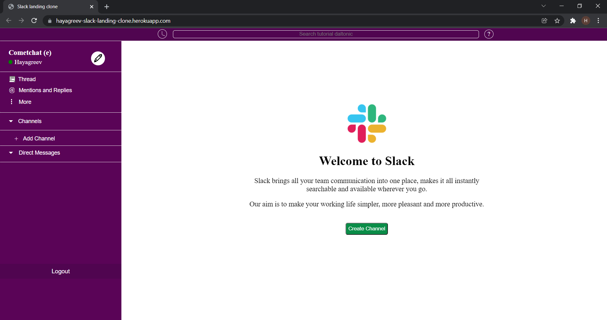

# Slack Landing Page Clone
This is an almost-clone of the slack landing page. I have added my touch to the design which is why this is an almost-clone of the existing slack landing page. This page is not yet responsive and I have built this completely using CSS. The buttons don't do anything yet but I'm thinking of adding backend functionality at a later point in time. I have added the screenshot of slack's default landing page that I have used as a reference to build the clone.

You can find the working version of this page at https://hayagreev-slack-landing-clone.herokuapp.com/

# Screenshot of the page:

This code is open-source. Feel free to use this code as a reference for your projects but please give me credits, coz, let's agree, leaching sucks!

Feel free to leave your comments at hayagreev.varadarajan@outlook.com!
